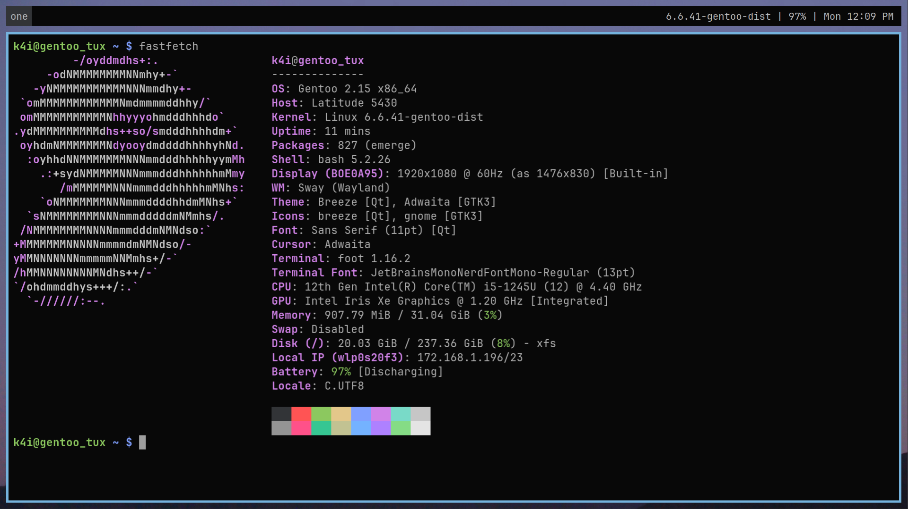

# Ricing gentoo with swaywm

# Note
- Colorscheme: moonfly https://github.com/bluz71/vim-moonfly-colors
- Check this link for bash config https://github.com/awesome-lists/awesome-bash?tab=readme-ov-file
- Custom bash script in bash_profile and bashrc allow using fzf as an application launcher
